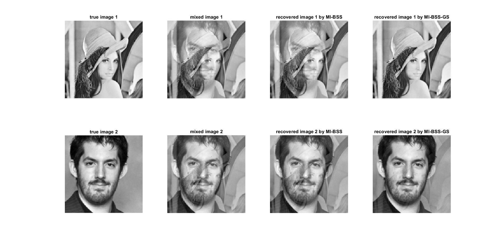
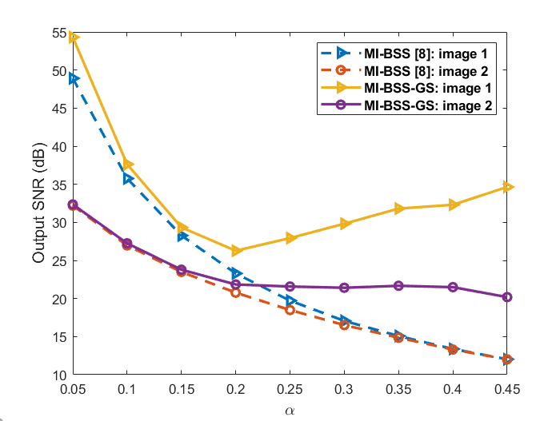

# MI-BSS-GS: Blind Separation of Smooth Graph Signals with Known Graphs
This repository implements a demo for **Robust blind separation of smooth graph signals using minimization of graph regularized mutual information** using the proposed **MI-BSS-GS** method, similar to the Figures 6 and 7 in our paper [1]. In the case of finding its contents useful for your research work, kindly please cite our paper [1] addressed below. Thanks a lot for your attention.

[[1] Einizade, Aref, and Sepideh Hajipour Sardouie. "Robust blind separation of smooth graph signals using minimization of graph regularized mutual information." Digital Signal Processing 132 (2022): 103792.](https://doi.org/10.1016/j.dsp.2022.103792)

The codes were written in MATLAB 2018b, and the [GSPBOX](https://epfl-lts2.github.io/gspbox-html/) toolbox are also needed to run this demo.

- Run `Demo_MI_BSS_GS.m` to generate the desired results. 

  

Thanks a lot for your attention.
